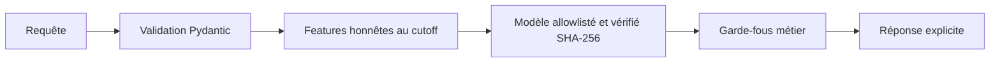

# API modèles e-commerce

API FastAPI locale et dockerisée pour la baseline de recommandation et la simulation pricing. La documentation OpenAPI est disponible sur `/docs` et le schéma sur `/openapi.json`.

## Périmètre métier

- Recommandation générale : `popularite_globale`, baseline validée, sans personnalisation forte.
- Complément panier : aucun modèle personnalisé validé ; fallback explicite vers `popularite_globale`.
- Pricing : `lgbm_tweedie_moyenne`, WAPE `0,5526`, biais `+0,0013`, usage exploratoire et non causal.
- Sessionnel : non utilisable, route stable en HTTP 501.
- Forecasting : non exposé dans cette première API.
- Aucune décision, remise ou recommandation n'est appliquée automatiquement. Une validation humaine est obligatoire.



## Démarrage local

```bash
python -m pip install -r requirements-api-dev.lock
python -m api.scripts.build_model_bundle
uvicorn api.main:app --host 0.0.0.0 --port 8000
```

Variables disponibles : `APP_ENV`, `API_HOST`, `API_PORT`, `LOG_LEVEL`, `MODEL_ROOT`, `API_KEY` et `CORS_ORIGINS`. Si `API_KEY` est non vide, toutes les routes `/api/v1/*` exigent l'en-tête `X-API-Key`. `/health` et `/ready` restent publics. Aucun secret ne doit être inscrit dans l'image ou dans Git.

## Docker

```bash
docker compose build
docker compose up -d
docker compose ps
docker compose down
```

Le smoke test Docker automatisé se lance avec `RUN_DOCKER_TESTS=1 python -m pytest api/tests/test_docker.py -q`. Il construit l'image, attend le healthcheck, appelle les routes réelles, vérifie l'absence de `.env`, de tests et de variables sensibles, puis arrête proprement le conteneur.

Le conteneur tourne en utilisateur non-root, avec système de fichiers en lecture seule, capacités Linux supprimées et healthcheck sur `/ready`.

## Routes et exemples

```bash
curl http://localhost:8000/health
curl http://localhost:8000/ready
curl http://localhost:8000/api/v1/models/status
```

```bash
curl -X POST http://localhost:8000/api/v1/recommendations/general \
  -H 'Content-Type: application/json' \
  -d '{"client_key":"CLI000001","k":10,"exclude_product_keys":[],"eligible_product_keys":[]}'
```

```bash
curl -X POST http://localhost:8000/api/v1/recommendations/basket \
  -H 'Content-Type: application/json' \
  -d '{"product_keys":["PRD000001"],"k":10,"eligible_product_keys":[]}'
```

```bash
curl -X POST http://localhost:8000/api/v1/pricing/simulate \
  -H 'Content-Type: application/json' \
  -d '{"product_key":"PRD000001","decision_date":"2026-08-18","candidate_discounts_pct":[0],"features":{"stock_at_cutoff":100}}'
```

Une réponse pricing contient toujours `model_status: exploratory_non_causal`, `automatic_application_allowed: false`, `human_validation_required: true` et `causal_effect_estimated: false`. Une remise hors support historique, un prix sous coût, une marge inférieure à 5 % ou une feature hors registre produit une erreur explicite sans prédiction.

## Mise à jour sécurisée des modèles

1. Mettre à jour les sources officielles et `models/FINAL_STATUS.json`.
2. Recalculer son manifeste SHA-256 avec la procédure du projet.
3. Vérifier que le pricing actif est `lgbm_tweedie_moyenne`, que la recommandation active est `popularite_globale` et que l'historique fuité reste invalidé.
4. Exécuter `python -m api.scripts.build_model_bundle` depuis la racine.
5. Exécuter lint, tests, build et smoke test Docker.
6. Revoir manuellement les SHA de `models/api_bundle/manifest.sha256.json` avant livraison.

Le chargeur runtime ne désérialise que `models/api_bundle/pricing_model.joblib`, à chemin fixe et présent dans une allowlist. Un chemin fourni par une requête n'est jamais chargé. Toute incohérence de SHA, version ou modèle met `/ready` en HTTP 503 ; la sélection d'un modèle invalidé interrompt le démarrage.

## Limites

Les scores de recommandation sont des scores de popularité normalisés, pas des probabilités. Le contexte panier sert uniquement à exclure les produits déjà présents. La simulation pricing estime une quantité associée à un scénario historiquement supporté ; elle n'estime pas un effet causal de la remise, ne recherche pas un prix optimal continu et n'autorise aucune application automatique.
